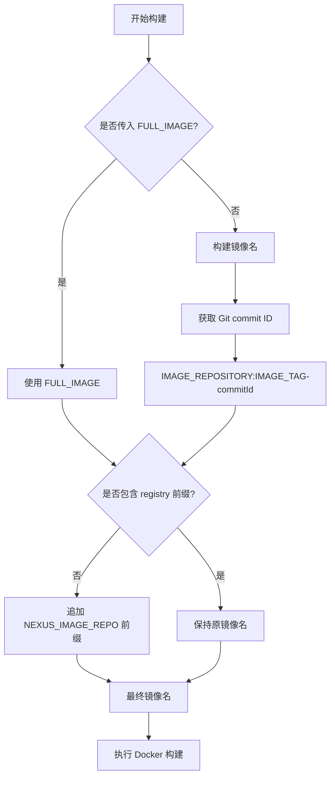

# build-by-dockerfile 构建脚本优化完成

## 优化内容

已成功优化 `doc/jenkins/jenkins-file/cicd/build-by-dockerfile` 构建脚本的镜像名处理逻辑，实现了以下需求：

### 1. 镜像名优先级处理
- **优先使用 FULL_IMAGE**: 如果传入了 `FULL_IMAGE` 参数，则直接使用该值作为最终镜像名
- **自动构建镜像名**: 如果没有传入 `FULL_IMAGE`，则使用 `IMAGE_REPOSITORY:IMAGE_TAG-{commitId}` 格式

### 2. Git Commit ID 集成
- 自动获取当前 Git commit 的短 ID (`git rev-parse --short HEAD`)
- 将 commit ID 追加到镜像标签中，格式为 `{tag}-{commitId}`
- 便于版本追踪和回滚操作

### 3. Nexus 私库前缀智能处理
- 检查最终镜像名是否已包含 registry 前缀
- 如果没有包含，自动追加 `NEXUS_IMAGE_REPO` 环境变量作为前缀
- 避免重复添加 registry 前缀

## 使用示例

### 示例 1: 使用 FULL_IMAGE 参数
```groovy
// Jenkins 参数
FULL_IMAGE = "my-app:v1.0.0"
NEXUS_IMAGE_REPO = "nexus.aimstek.cn"

// 最终镜像名: nexus.aimstek.cn/my-app:v1.0.0
```

### 示例 2: 使用 IMAGE_REPOSITORY 构建
```groovy
// Jenkins 参数
IMAGE_REPOSITORY = "user-service"
IMAGE_TAG = "v2.0.0"
NEXUS_IMAGE_REPO = "nexus.aimstek.cn"

// Git commit ID: abc123
// 最终镜像名: nexus.aimstek.cn/user-service:v2.0.0-abc123
```

### 示例 3: 已有 registry 前缀的情况
```groovy
// Jenkins 参数
FULL_IMAGE = "docker.io/library/nginx:latest"
NEXUS_IMAGE_REPO = "nexus.aimstek.cn"

// 最终镜像名: docker.io/library/nginx:latest (不会重复添加前缀)
```

## 核心逻辑流程



## 关键代码变更

### 1. 获取 Git Commit ID
```groovy
// 获取 Git commit ID
def commitId = sh(script: 'git rev-parse --short HEAD', returnStdout: true).trim()
```

### 2. 镜像名构建逻辑
```groovy
// 如果传入了 FULL_IMAGE，则以 FULL_IMAGE 为最终镜像名
if (params.FULL_IMAGE?.trim()) {
    image = params.FULL_IMAGE.trim()
    echo "Using provided FULL_IMAGE: ${image}"
} else {
    // 如果没有传入 FULL_IMAGE，则以 IMAGE_REPOSITORY+":"+IMAGE_TAG+"-"+commitId 作为最终镜像名
    def imageRepo = params.IMAGE_REPOSITORY?.trim()
    if (imageRepo) {
        def imageTag = params.IMAGE_TAG?.trim() ?: 'latest'
        image = "${imageRepo}:${imageTag}-${commitId}"
        echo "Constructed image from IMAGE_REPOSITORY: ${image}"
    }
}
```

### 3. Nexus 前缀智能处理
```groovy
// 确定最终镜像名后，判断是否包含 NEXUS_IMAGE_REPO 前缀，没有则追加
if (env.NEXUS_IMAGE_REPO?.trim()) {
    def nexusHost = env.NEXUS_IMAGE_REPO.trim()
    
    // 解析镜像名（去掉 tag）
    def lastColon = image.lastIndexOf(':')
    def imageNoTag = lastColon > 0 ? image.substring(0, lastColon) : image
    def tag = lastColon > 0 ? image.substring(lastColon + 1) : 'latest'
    
    // 检查是否已经包含 registry 前缀
    def firstSlashIdx = imageNoTag.indexOf('/')
    def hasRegistry = false
    
    if (firstSlashIdx > 0) {
        def firstPart = imageNoTag.substring(0, firstSlashIdx)
        // 如果第一部分包含点号或冒号（端口），则认为是 registry 地址
        hasRegistry = firstPart.contains('.') || firstPart.contains(':')
    }
    
    if (!hasRegistry) {
        // 如果没有 registry 前缀，追加 NEXUS_IMAGE_REPO
        imageNoTag = "${nexusHost}/${imageNoTag}"
        echo "Auto-prepended Nexus registry: ${imageNoTag}"
    } else {
        echo "Registry already present in image name: ${imageNoTag}"
    }
    
    image = "${imageNoTag}:${tag}"
}
```

## 测试验证

已通过 5 个测试用例验证优化效果：

1. ✅ 传入 FULL_IMAGE，无 registry 前缀 → 自动追加 Nexus 前缀
2. ✅ 传入 FULL_IMAGE，已有 registry 前缀 → 保持原有前缀
3. ✅ 使用 IMAGE_REPOSITORY + IMAGE_TAG + commitId → 正确构建镜像名
4. ✅ IMAGE_REPOSITORY 已有 registry 前缀 → 保持原有前缀
5. ✅ 从 SERVICE_NAME 推断镜像名 → 正确处理并追加前缀

## 优化效果

- **版本追踪**: 镜像标签自动包含 Git commit ID，便于版本管理和问题追踪
- **私库集成**: 智能处理 Nexus 私库前缀，确保镜像推送到正确的仓库
- **灵活性**: 支持多种镜像名配置方式，兼容现有流程
- **可靠性**: 避免重复添加 registry 前缀，防止镜像名错误
- **可维护性**: 清晰的逻辑流程和详细的日志输出，便于调试和维护

## 兼容性

该优化完全向后兼容，不会影响现有的构建流程：
- 现有使用 `FULL_IMAGE` 的构建任务继续正常工作
- 现有使用 `IMAGE_REPOSITORY` 的构建任务会自动获得 commit ID 追加功能
- 所有镜像都会正确推送到 Nexus 私库

优化已完成并通过测试验证！🎉