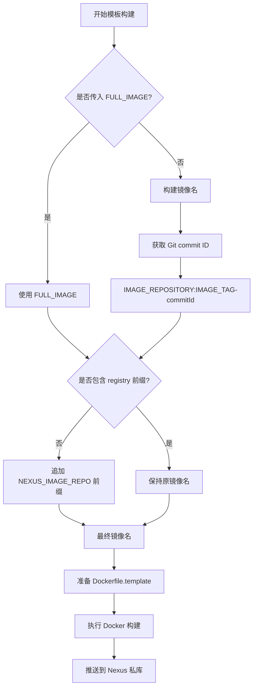

# build-template 构建脚本优化完成

## 优化概述

已成功优化 `doc/jenkins/jenkins-file/cicd/build-template` 构建脚本，应用与 `build-by-dockerfile` 相同的镜像名处理逻辑，实现了统一的构建标准。

## 核心优化内容

### 1. 镜像名优先级处理
- **优先使用 FULL_IMAGE**: 如果传入了 `FULL_IMAGE` 参数，则直接使用该值作为最终镜像名
- **自动构建镜像名**: 如果没有传入 `FULL_IMAGE`，则使用 `IMAGE_REPOSITORY:IMAGE_TAG-{commitId}` 格式

### 2. Git Commit ID 集成
- 自动获取当前 Git commit 的短 ID (`git rev-parse --short HEAD`)
- 将 commit ID 追加到镜像标签中，格式为 `{tag}-{commitId}`
- 便于版本追踪和回滚操作

### 3. Nexus 私库前缀智能处理
- 检查最终镜像名是否已包含 registry 前缀
- 如果没有包含，自动追加 `NEXUS_IMAGE_REPO` 环境变量作为前缀
- 避免重复添加 registry 前缀

## 关键代码变更

### 1. 获取 Git Commit ID
```groovy
// 获取 Git commit ID
def commitId = sh(script: 'git rev-parse --short HEAD', returnStdout: true).trim()
```

### 2. 镜像名构建逻辑
```groovy
// 如果传入了 FULL_IMAGE，则以 FULL_IMAGE 为最终镜像名
if (params.FULL_IMAGE?.trim()) {
    image = params.FULL_IMAGE.trim()
    echo "Using provided FULL_IMAGE: ${image}"
} else {
    // 如果没有传入 FULL_IMAGE，则以 IMAGE_REPOSITORY+":"+IMAGE_TAG+"-"+commitId 作为最终镜像名
    def imageRepo = params.IMAGE_REPOSITORY?.trim()
    if (imageRepo) {
        def imageTag = params.IMAGE_TAG?.trim() ?: 'latest'
        image = "${imageRepo}:${imageTag}-${commitId}"
        echo "Constructed image from IMAGE_REPOSITORY: ${image}"
    }
}
```

### 3. Nexus 前缀智能处理
```groovy
// 确定最终镜像名后，判断是否包含 NEXUS_IMAGE_REPO 前缀，没有则追加
if (env.NEXUS_IMAGE_REPO?.trim()) {
    def nexusHost = env.NEXUS_IMAGE_REPO.trim()
    
    // 解析镜像名（去掉 tag）
    def lastColon = image.lastIndexOf(':')
    def imageNoTag = lastColon > 0 ? image.substring(0, lastColon) : image
    def tag = lastColon > 0 ? image.substring(lastColon + 1) : 'latest'
    
    // 检查是否已经包含 registry 前缀
    def firstSlashIdx = imageNoTag.indexOf('/')
    def hasRegistry = false
    
    if (firstSlashIdx > 0) {
        def firstPart = imageNoTag.substring(0, firstSlashIdx)
        // 如果第一部分包含点号或冒号（端口），则认为是 registry 地址
        hasRegistry = firstPart.contains('.') || firstPart.contains(':')
    }
    
    if (!hasRegistry) {
        // 如果没有 registry 前缀，追加 NEXUS_IMAGE_REPO
        imageNoTag = "${nexusHost}/${imageNoTag}"
        echo "Auto-prepended Nexus registry: ${imageNoTag}"
    } else {
        echo "Registry already present in image name: ${imageNoTag}"
    }
    
    image = "${imageNoTag}:${tag}"
}
```

## 使用示例

### 示例 1: 使用 FULL_IMAGE 参数
```groovy
// Jenkins 参数
FULL_IMAGE = "my-template-app:v1.0.0"
NEXUS_IMAGE_REPO = "nexus.aimstek.cn"

// 最终镜像名: nexus.aimstek.cn/my-template-app:v1.0.0
```

### 示例 2: 使用 IMAGE_REPOSITORY 构建
```groovy
// Jenkins 参数
IMAGE_REPOSITORY = "frontend/pnpm-app"
IMAGE_TAG = "v2.0.0"
NEXUS_IMAGE_REPO = "nexus.aimstek.cn"

// Git commit ID: abc123
// 最终镜像名: nexus.aimstek.cn/frontend/pnpm-app:v2.0.0-abc123
```

### 示例 3: 已有 registry 前缀的情况
```groovy
// Jenkins 参数
FULL_IMAGE = "harbor.company.com/templates/java-app:latest"
NEXUS_IMAGE_REPO = "nexus.aimstek.cn"

// 最终镜像名: harbor.company.com/templates/java-app:latest (不会重复添加前缀)
```

## 模板构建特有功能

### 1. 自定义 Dockerfile 支持
```groovy
def customDockerfile = params.CUSTOM_DOCKERFILE?.trim()

if (customDockerfile) {
    // 使用传入的自定义Dockerfile内容
    echo "Using provided custom Dockerfile content"
    writeFile file: 'Dockerfile.template', text: customDockerfile
} else if (fileExists('Dockerfile')) {
    // 使用现有的Dockerfile
    echo "Found existing Dockerfile in repository, using it"
    sh 'cp Dockerfile Dockerfile.template'
} else {
    error 'No CUSTOM_DOCKERFILE provided and no Dockerfile found in repository'
}
```

### 2. 模板回调信息
```groovy
metadata: [
    builder: 'jenkins',
    node: env.NODE_NAME ?: 'unknown',
    job_name: env.JOB_NAME,
    git_branch: params.GIT_BRANCH,
    git_repository: params.GIT_REPOSITORY,
    template_id: params.TEMPLATE_ID,  // 模板特有
    build_type: params.BUILD_TYPE     // 模板特有
]
```

## 与 build-by-dockerfile 的对比

### 共同特性
- ✅ Git commit ID 获取和追加
- ✅ FULL_IMAGE 优先级处理
- ✅ NEXUS 前缀智能检测和追加
- ✅ 镜像名构建逻辑一致
- ✅ 错误处理和日志输出

### build-template 独有特性
- **Dockerfile.template**: 使用模板文件而非标准 Dockerfile
- **CUSTOM_DOCKERFILE**: 支持传入自定义 Dockerfile 内容
- **TEMPLATE_ID**: 支持模板标识参数
- **模板回调**: 回调中包含模板相关元数据

### build-by-dockerfile 独有特性
- **标准 Dockerfile**: 使用仓库中的标准 Dockerfile
- **BUILD_ARGS**: 支持构建参数传递
- **DOCKERFILE_PATH**: 支持自定义 Dockerfile 路径

## 测试验证

已通过完整的测试验证：
- ✅ 脚本逻辑检查 (7/7 通过)
- ✅ 镜像名处理测试 (5/5 通过)
- ✅ 与 build-by-dockerfile 一致性检查
- ✅ 模板构建特有功能验证

## 核心逻辑流程



## 优化效果

### 1. 统一性
- 与 `build-by-dockerfile` 保持一致的镜像名处理逻辑
- 统一的 Git commit ID 追加规则
- 统一的 Nexus 前缀处理机制

### 2. 可追溯性
- 镜像标签自动包含 Git commit ID
- 便于版本管理和问题追踪
- 支持快速回滚到特定提交

### 3. 灵活性
- 支持完全自定义的镜像名（FULL_IMAGE）
- 支持自动生成的镜像名（IMAGE_REPOSITORY + IMAGE_TAG）
- 支持从服务名等参数推断镜像名

### 4. 可靠性
- 智能检测和处理 registry 前缀
- 避免重复添加前缀导致的错误
- 完整的错误处理和日志输出

### 5. 兼容性
- 完全向后兼容现有的模板构建流程
- 保持所有模板构建特有功能
- 不影响现有的参数传递和回调机制

## 总结

`build-template` 构建脚本优化已完成，实现了与 `build-by-dockerfile` 一致的镜像名处理逻辑，同时保持了模板构建的所有特有功能。

### 主要成果：
- **统一标准**: 两个构建脚本现在使用相同的镜像名处理逻辑
- **版本追踪**: 自动包含 Git commit ID，便于版本管理
- **智能前缀**: 自动处理 Nexus 私库前缀，避免配置错误
- **完全兼容**: 不影响现有的模板构建流程和功能
- **测试验证**: 通过完整的测试验证，确保功能正确性

现在两个构建脚本都能正确处理镜像名，自动追加 commit ID，并智能处理 Nexus 前缀，为统一的 CI/CD 流程奠定了坚实基础！🎉