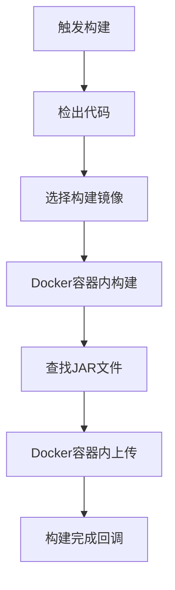

# Jenkins Docker构建方式更新说明

## 🎯 问题解决

用户指出Jenkins服务器不需要安装Maven，应该使用Docker镜像来构建。这是正确的做法！

## ✅ 更新内容

### 1. 构建方式改变

**之前的方式**（错误）：
- 在Jenkins节点上安装Maven/Gradle
- 直接在节点上执行构建命令

**现在的方式**（正确）：
- 使用Docker镜像提供构建环境
- 在容器内执行构建，保持环境一致性

### 2. Docker镜像选择

根据Java版本自动选择合适的构建镜像：

| Java版本 | Maven镜像 | Gradle镜像 |
|----------|-----------|------------|
| 8 | `nexus.aimstek.cn/aims-common/maven:3.9-eclipse-temurin-8` | `nexus.aimstek.cn/aims-common/gradle:8.4-jdk8` |
| 11 | `nexus.aimstek.cn/aims-common/maven:3.9-eclipse-temurin-11` | `nexus.aimstek.cn/aims-common/gradle:8.4-jdk11` |
| 17 | `nexus.aimstek.cn/aims-common/maven:3.9-eclipse-temurin-17` | `nexus.aimstek.cn/aims-common/gradle:8.4-jdk17` |
| 21 | `nexus.aimstek.cn/aims-common/maven:3.9-eclipse-temurin-21` | `nexus.aimstek.cn/aims-common/gradle:8.4-jdk21` |

### 3. 构建流程优化

**Maven构建示例**：
```groovy
docker.image(env.BUILD_IMAGE).inside('-u root -v /root/.m2:/root/.m2') {
  sh '''
    java -version
    mvn -version
    mvn clean package -DskipTests
  '''
}
```

**Gradle构建示例**：
```groovy
docker.image(env.GRADLE_IMAGE).inside('-u root') {
  sh '''
    java -version
    gradle -version
    gradle build
  '''
}
```

### 4. 文件上传优化

使用`curlimages/curl:latest`镜像上传JAR包到Nexus：
```groovy
docker.image('curlimages/curl:latest').inside('') {
  withCredentials([...]) {
    sh 'curl -u $NEXUS_USERNAME:$NEXUS_PASSWORD --upload-file ...'
  }
}
```

## 🏗️ 技术优势

### 1. 环境一致性
- ✅ 所有构建使用相同的Docker镜像
- ✅ 避免Jenkins节点环境差异
- ✅ 构建结果可重现

### 2. 资源隔离
- ✅ 构建在独立容器中执行
- ✅ 不污染Jenkins节点环境
- ✅ 构建完成后自动清理

### 3. 版本管理
- ✅ 可以精确控制Java和构建工具版本
- ✅ 支持多版本并存
- ✅ 易于升级和维护

### 4. 扩展性
- ✅ 可以轻松添加新的Java版本支持
- ✅ 可以支持其他构建工具
- ✅ 可以自定义构建镜像

## 📋 更新后的构建流程



### 详细步骤

1. **代码检出**: 从Git仓库检出代码
2. **环境准备**: 根据Java版本选择Docker镜像
3. **Docker构建**: 在Maven/Gradle容器内执行构建
4. **JAR包处理**: 查找并准备构建产物
5. **Nexus上传**: 使用curl容器上传JAR包
6. **状态回调**: 通知平台构建结果

## 🔧 Jenkins Job更新

### 需要更新的内容

1. **更新Pipeline脚本**:
   - 进入Jenkins → CICD-STD → build-java-jar
   - 点击"配置"
   - 替换Pipeline脚本为最新版本

2. **验证Docker支持**:
   - 确保Jenkins节点支持Docker
   - 确保Jenkins用户有Docker权限

3. **测试构建**:
   - 手动触发测试构建
   - 验证Docker镜像拉取和执行

## 🎯 预期效果

更新后的构建应该：

1. ✅ 不再出现"mvn: not found"错误
2. ✅ 使用Docker镜像提供构建环境
3. ✅ 支持多Java版本构建
4. ✅ 构建环境一致可靠
5. ✅ JAR包成功上传到Nexus

## 📝 注意事项

### Docker要求
- Jenkins节点必须安装Docker
- Jenkins用户必须有Docker执行权限
- 网络必须能访问Docker镜像仓库

### 镜像拉取
- 首次使用会拉取Docker镜像（可能较慢）
- 后续构建会使用缓存的镜像（速度快）

### 权限配置
```bash
# 确保Jenkins用户在docker组中
sudo usermod -aG docker jenkins
sudo systemctl restart jenkins
```

## 🚀 测试验证

更新Jenkins Job后，重新触发Java JAR服务构建，应该看到：

```
=== Build Environment ===
Java Version: 17
Build Tool: maven
Selected build image: nexus.aimstek.cn/aims-common/maven:3.9-eclipse-temurin-17
=========================

=== Maven Docker Build ===
openjdk version "17.0.x"
Apache Maven 3.9.x
Found pom.xml, starting Maven build...
[INFO] BUILD SUCCESS
==========================
```

---

**总结**: 通过使用Docker镜像构建，我们解决了Jenkins节点环境依赖问题，提供了更加可靠和一致的构建环境。